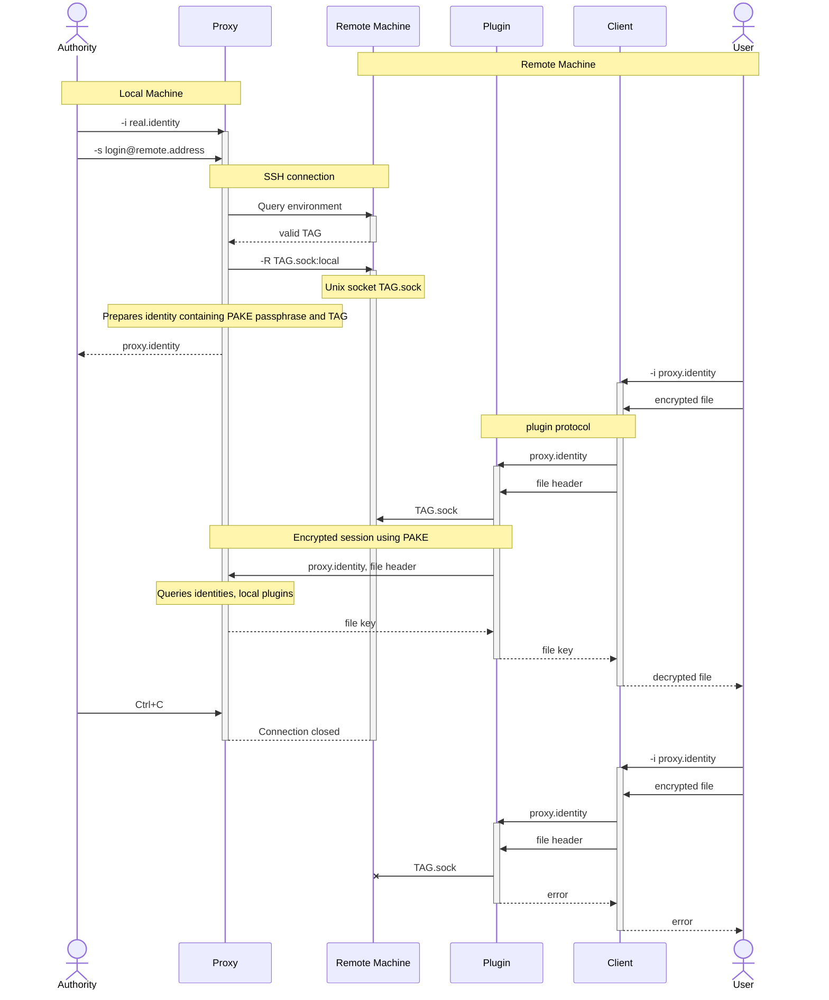

# `age-plugin-remote`

TBD

## Design Notes

Proxy identities act as bearer tokens. A proxy identity is only "active" if the authority
provides it when starting the agent. The proxy identity may access all real identities
that the authority provides when starting the agent.

`TAG` exists because `PORT` is too small to be collision-resistant across multiple
restarts. A 32-bit `TAG` can be persisted in the proxy identity file, and then reused with
a small-enough chance of collision (since we only care about collisions on a per-user
level, and similar age tags in other identities are also 32 bits). The proxy run by the
agent provides the live mapping from `TAG` to `PORT`.

To reuse proxy identities, you might need a one-time remote server setup:

```
sudo sh -c 'echo "StreamLocalBindUnlink yes" >> /etc/ssh/sshd_config'
```

Or if we end up querying the environment before we start, we could also take the time to
clear out the old socket file, assuming we can verify that it isn't actually being used?



## License

Licensed under either of

 * Apache License, Version 2.0, ([LICENSE-APACHE](LICENSE-APACHE) or
   http://www.apache.org/licenses/LICENSE-2.0)
 * MIT license ([LICENSE-MIT](LICENSE-MIT) or http://opensource.org/licenses/MIT)

at your option.

### Contribution

Unless you explicitly state otherwise, any contribution intentionally
submitted for inclusion in the work by you, as defined in the Apache-2.0
license, shall be dual licensed as above, without any additional terms or
conditions.
